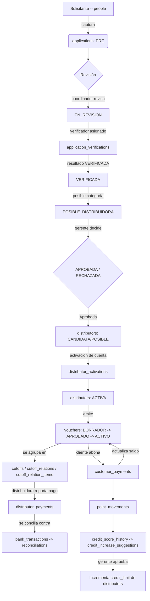

# Análisis del Sistema — Vouchers Platform API (v1)

> Documento de apuntes generado a partir del análisis de las migraciones existentes en
> `database/migrations/`. Es la **primera versión** de este análisis: sirve como base de
> entendimiento antes de recibir el contexto/requerimientos oficiales adicionales. Una
> vez se compartan esas referencias, se generará una v2 con mayor precisión y alcance.

Rama de trabajo: `Axel` (creada a partir de `luna`).

---

## 1. ¿Qué es este sistema?

Es una **plataforma de vales/crédito a través de distribuidoras** (similar a un sistema de
"vales de despensa" o crédito informal con cobranza puerta a puerta), donde:

- Una **empresa central** (con **sucursales/branches**) administra el negocio.
- Existen **distribuidoras** (personas o negocios) que son la cara visible ante el cliente
  final: ellas **emiten vales de crédito** a **clientes**, cobran los pagos quincenales, y
  luego le rinden cuentas a la empresa en **cortes (cutoffs)** periódicos.
- Los **clientes** reciben un vale (crédito) por un monto, y lo pagan en abonos quincenales
  (fortnights) a través de su distribuidora.
- La empresa gana por comisiones, intereses y seguros incluidos en cada vale; la
  distribuidora gana por "puntos" y por un porcentaje de utilidad/comisión.
- Existe un sistema de **puntos** que recompensa a las distribuidoras por cobranza
  puntual/anticipada, y las penaliza por atrasos. Los puntos pueden acumularse y
  eventualmente convertirse en incrementos de línea de crédito o beneficios.
- Todo el flujo de alta de una distribuidora pasa por un proceso de **solicitud
  (application)**: captura de datos, revisión, **verificación domiciliaria/física**
  (con geolocalización y evidencia fotográfica), aprobación por un gerente, y activación.

En resumen: es un **CRM + core financiero de microcréditos operado por una red de
distribuidoras**, con conciliación bancaria, control de cortes de pago, control de
puntos/incentivos y trazabilidad/auditoría de decisiones administrativas.

---

## 2. Roles identificados

Los roles de negocio se identifican en dos lugares: la tabla de negocio `roles` +
`user_role` (pivote con sucursal) y el seeder `RolesAndPermissionSeeder` (que usa
Spatie Permission). Los roles detectados son:

| Rol (code)          | Función dentro del sistema                                                                 |
|---------------------|----------------------------------------------------------------------------------------------|
| `administrator`      | Consulta global de solo lectura: estadísticas, entradas/salidas, autorizaciones, bitácoras y cualquier dato auditable; no registra, modifica ni autoriza. |
| `general_manager`    | Administra productos y planes de vales, distribuidoras de todas las sucursales, incrementos de crédito y decisiones de alto nivel (`manager_decision_logs`). |
| `branch_manager`     | Administra una sucursal: configuración (`branch_settings`), supervisión de cortes y autorización de aperturas de línea de crédito. |
| `coordinator`        | Supervisa distribuidoras de su zona/sucursal: revisa solicitudes, aprueba transferencias de clientes entre distribuidoras. |
| `verifier`           | Realiza la verificación física/domiciliaria de solicitudes (visita, fotos, geolocalización) — tabla `application_verifications`. |
| `cashier`            | Captura pagos de clientes (`customer_payments.collected_by_user_id`), maneja caja, solicita cambios de datos de cliente y realiza conciliaciones manuales. |
| `distributor`        | Usuario asociado 1 a 1 con el registro `distributors`; emite vales, cobra a clientes, reporta pagos a la empresa. |

Adicionalmente existen conceptos de **cliente final** (`customers`) que probablemente no
inicia sesión en el sistema web (no tiene tabla `users` asociada), sino que es gestionado
por la distribuidora/sucursal.

> ⚠️ Nota importante detectada: el proyecto usa **dos sistemas de roles en paralelo**:
> 1. Tablas propias `roles` + `user_role` (con `branch_id`, `is_primary`, soft deletes) —
>    pensadas para reglas de negocio (a qué sucursal pertenece el usuario, rol principal, etc.).
> 2. `spatie/laravel-permission` (paquete instalado y usado en `User` vía `HasRoles`, y en
>    `RolesAndPermissionSeeder` para permisos como `branches_view`).
>
> Sin embargo, **las migraciones de tablas de Spatie (`roles`, `permissions`,
> `model_has_roles`, `model_has_permissions`, `role_has_permissions`) no existen** en
> `database/migrations`. Esto es una decisión pendiente: o se usan las tablas propias
> (`roles`/`user_role`) como única fuente de roles y se retira `HasRoles`/Spatie, o se
> publican las migraciones de Spatie y conviven ambos sistemas (uno para roles de negocio
> con contexto de sucursal, otro para permisos/gates finos). Se debe definir antes de
> construir los endpoints de autenticación/autorización.

---

## 3. Entidades principales y su propósito

### Identidad y acceso
- **`people`**: datos personales genéricos (nombre, CURP, RFC, contacto, domicilio). Es la
  base de la que cuelgan `users`, `distributors` (vía `person_id`) y los solicitantes de
  `applications` (`applicant_person_id`).
- **`users`**: cuenta de acceso al sistema (1 a 1 con `people`). Usa `username` +
  `password_hash` (no email/password como el scaffold de ejemplo), `login_channel`
  (WEB/VPN_WEB/MOVIL), `requires_vpn`, soft deletes.
- **`roles`** / **`user_role`**: catálogo de roles de negocio y su asignación a usuarios,
  con sucursal (`branch_id`) y bandera `is_primary`.
- **`branches`**: sucursales de la empresa (código, nombre, dirección, teléfono).
- **`branch_settings`** / **`branch_settings_logs`**: configuración financiera por
  sucursal (día de corte, frecuencia de pago, comisión de apertura, interés quincenal,
  penalización por atraso, umbral de incremento automático) + bitácora de cambios.

### Catálogos de producto/negocio
- **`distributor_categories`**: categorías de distribuidoras (ej. COPPER, etc. — ver
  `applications.initial_category_code`), cada una con % de comisión, puntos por cada 1200
  cobrados, y % de penalización por atraso.
- **`financial_products`**: productos financieros/tipos de vale (monto principal, número
  de quincenas, comisión de la empresa, seguro, interés quincenal, monto de recargo por
  atraso, método de dispersión).
- **`point_settings`**: configuración global **singleton** del sistema de puntos (factor
  divisor, multiplicador, valor en MXN de cada punto, % de penalización). El administrador
  solo la consulta; falta confirmar qué rol puede modificarla.
- **`bank_accounts`**: cuentas bancarias polimórficas por `owner_type`
  (PERSONA/DISTRIBUIDORA/EMPRESA) + `owner_id`.

### Alta de distribuidoras (onboarding)
- **`applications`**: solicitud de alta (de una persona para convertirse en distribuidora).
  Contiene datos capturados (JSON de familia, afiliaciones externas, vehículos), documentos
  (INE frente/reverso, comprobante de domicilio, buró de crédito), estatus de flujo (PRE →
  MODIFICADA → EN_REVISION → VERIFICADA → POSIBLE_DISTRIBUIDORA → APROBADA/RECHAZADA), y
  actores (capturador, coordinador, verificador asignado).
- **`application_verifications`**: resultado de la visita de verificación física —
  checklist, evidencias fotográficas, geolocalización y distancia calculada respecto al
  domicilio declarado.
- **`manager_decision_logs`**: bitácora de decisiones de gerentes sobre solicitudes/
  distribuidoras (alta, incrementos de límite, aprobación/rechazo), con montos antes/después.
- **`distributor_activations`**: token de activación de cuenta (para que el nuevo usuario
  distribuidor establezca su contraseña por primera vez).

### Distribuidoras y clientes
- **`distributors`**: registro operativo de la distribuidora (1 a 1 con `people` y
  opcionalmente con `applications`). Maneja línea de crédito (`credit_limit`,
  `available_credit`, `unlimited_credit`), puntos acumulados, bandera para emitir vales,
  estatus de ciclo de vida (CANDIDATA → POSIBLE → ACTIVA → INACTIVA/MOROSA/BLOQUEADA/CERRADA).
- **`customers`**: cliente final que recibe vales. Tiene su propio flujo de verificación
  (fotos INE, selfie, comprobante domicilio) y estatus (EN_VERIFICACION, ACTIVO, BLOQUEADO,
  MOROSO, INACTIVO).
- **`customer_distributor`**: relación N a N entre cliente y distribuidora (un cliente
  puede vincularse a varias distribuidoras a través del tiempo), con estatus de la
  relación y bandera de aprobación ("prevale_approved").
- **`customer_transfer_requests`**: solicitud formal para mover a un cliente de una
  distribuidora a otra, con aprobación de coordinador y confirmación por código (flujo
  tipo OTP): PENDIENTE_COORDINADOR → APROBADA_CODIGO_EMITIDO → EJECUTADA/RECHAZADA/
  CANCELADA/EXPIRADA.

### El vale (core del negocio)
- **`vouchers`**: el vale de crédito emitido a un cliente por una distribuidora, ligado a
  un producto financiero. Congela ("snapshot") los porcentajes de comisión, seguro,
  interés y utilidad del distribuidor vigentes al momento de emitirlo (para no verse
  afectado por cambios futuros en catálogos). Controla el ciclo de vida completo:
  BORRADOR → APROBADO → TRANSFERIDO → ACTIVO → PAGO_PARCIAL → PAGADO → LIQUIDADO, con
  ramas de excepción: MOROSO, RECLAMADO, CANCELADO, REVERSADO. Guarda saldo actual,
  pagos quincenales, número de quincenas totales/realizadas.
- **`customer_payments`**: abonos que el cliente realiza sobre un vale (efectivo o
  transferencia), capturados por un cajero. Pueden ser parciales, afectar o no el cálculo
  de puntos, y pueden revertirse (reverso con motivo y usuario).

### Cortes (rendición de cuentas de la distribuidora)
- **`cutoffs`**: corte programado por sucursal (tipo PAGOS/PUNTOS/MIXTO), con fecha
  programada/ejecutada y estatus (PROGRAMADO → EJECUTADO → CERRADO, o REPROCESADO).
- **`cutoff_relations`**: la "relación de corte" por distribuidora dentro de un corte:
  snapshot de línea de crédito/puntos, total de comisión, total a pagar, recargos,
  referencia de pago, fechas límite de pago (con ventana de pronto pago). Soporta
  encadenar cortes (`previous_relation_id`, `total_carryover_received`) para arrastre de
  saldos entre periodos.
- **`cutoff_relation_items`**: el detalle línea por línea (por vale) dentro de una
  relación de corte: comisión, pago, recargo, número de abono/quincena, si es pago
  atrasado, y trazabilidad de abonos atrasados acumulados y de origen (cuando un
  abono se re-clasifica en un corte posterior).
- **`distributor_payments`**: pago que la distribuidora reporta a la empresa contra una
  `cutoff_relation` (o un `cutoff_relation_item` específico), con estatus de conciliación
  (REPORTED → DETECTED → RECONCILED/REJECTED) y desglose de vales que cubre.
- **`bank_transactions`**: movimientos bancarios reales importados/registrados de la
  cuenta de la empresa (para conciliar contra lo reportado por las distribuidoras).
- **`reconciliations`**: conciliación 1 a 1 entre un `distributor_payment` (lo reportado)
  y un `bank_transaction` (lo real en banco), con diferencia de monto y estatus.

### Puntos, score de crédito e incentivos
- **`point_movements`**: bitácora de movimientos de puntos por distribuidora (ganado
  anticipado, ganado puntual, penalización por atraso, ajuste manual, reverso, canje),
  ligados opcionalmente a un vale, un corte o un pago de cliente.
- **`credit_score_history`**: evaluación mensual (score base/final, factores en JSON,
  incremento sugerido, si se aplicó automáticamente) por distribuidora.
- **`credit_increase_suggestions`**: sugerencias concretas de incremento de línea de
  crédito derivadas del score, sujetas a aprobación/rechazo por un gerente.

### Soporte, auditoría y varios
- **`simulated_company_expenses`**: registro de "gastos simulados" de la empresa
  asociados a un vale/cliente/distribuidora (p. ej. vale de días feriados/"vale
  feriado" con fuente `VALE_FERIADO`), para efectos contables internos.
- **`password_requests`**: solicitud de restablecimiento de contraseña que requiere
  aprobación de un usuario autorizado (no es el flujo estándar de Laravel por correo,
  sino un flujo interno con estatus PENDIENTE/APROBADA/RECHAZADA/EXPIRADA).
- **`audit_logs`**: bitácora genérica de auditoría (evento, nivel, usuario, rol, sucursal,
  módulo, descripción, datos extra en JSON, IP, user agent) para trazabilidad general.
- **`notifications`**, **`sessions`**, **`password_reset_tokens`**: tablas estándar de
  Laravel (notificaciones de base de datos, sesiones, tokens de restablecimiento nativo).
  No requieren modelo propio.

---

## 4. Flujos de negocio inferidos

1. **Onboarding de distribuidora**: `applications` → `application_verifications` →
   decisión de gerente (`manager_decision_logs`) → `distributors` → `distributor_activations`.
2. **Onboarding/gestión de cliente**: `people` → `customers` → `customer_distributor`
   (vínculo con una o más distribuidoras) → opcionalmente `customer_transfer_requests`
   para reasignar de distribuidora.
3. **Emisión y cobro de vale**: `vouchers` (con snapshots financieros del producto y la
   categoría vigente) → `customer_payments` (abonos quincenales) → actualización de
   `current_balance`/`payments_made` → generación de `point_movements`.
4. **Corte y rendición de cuentas**: `cutoffs` (programado por sucursal) →
   `cutoff_relations` (una por distribuidora) → `cutoff_relation_items` (una por vale) →
   la distribuidora paga vía `distributor_payments` → conciliación bancaria
   (`bank_transactions` + `reconciliations`).
5. **Incentivos**: `point_movements` alimentan `distributors.current_points` →
   evaluación mensual en `credit_score_history` → `credit_increase_suggestions` →
   aprobación de gerente que incrementa `credit_limit`.

---

## 4.1 Reglas recibidas en reuniones (pendientes de confirmación)

Estas reglas orientan la primera implementación. Se deben representar como capacidades
configurables por rol y no como condiciones fijas en controladores, porque el dueño del
negocio puede reasignar responsabilidades.

- La distribuidora asume la responsabilidad del pago ante la empresa; los cortes,
  conciliaciones y saldos deben conservar esa trazabilidad.
- Una distribuidora pertenece a una sucursal. Cada sucursal concentra coordinadores,
  verificadores, cajeros y distribuidoras.
- Coordinador y verificador operan una aplicación web adaptada a tableta; el verificador
  puede realizar las tareas de captura del coordinador, sin que la relación inversa esté
  confirmada.
- El primer vale de un cliente es un **pre-vale**. Si la línea disponible de la
  distribuidora está totalmente disponible, su importe no puede superar el 50% de esa
  línea. Después de cada incremento de límite se vuelve a aplicar el 50%, con una
  tolerancia mencionada de +/- $500 que aún requiere definición exacta.
- Los vales posteriores son vales digitales. Sus cálculos deben partir de porcentajes del
  producto/categoría y congelar los importes resultantes en el vale.
- El gerente de sucursal autoriza aperturas de cuenta de crédito; el gerente general
  puede autorizar operaciones entre sucursales, incrementos de crédito y transferencias.
- La cajera solicita autorización para modificar datos de cliente y puede hacer
  conciliaciones manuales.
- Un cliente puede transferirse a otra distribuidora: la receptora acepta, se notifica al
  coordinador de origen y éste autoriza antes de ejecutar el cambio.
- El administrador es exclusivamente de lectura global.

---

## 5. Funcionalidades / módulos que probablemente se deberán construir

Esta lista es una **lluvia de ideas basada en el esquema**, para discutir antes de picar
código de endpoints (según lo solicitado). No es definitiva.

### Autenticación y usuarios
- Login con `username` + `password_hash` (no email), posiblemente 2 canales (WEB / VPN_WEB / MOVIL).
- Gestión de roles por usuario y sucursal (`user_role`), con rol primario.
- Flujo de activación de cuenta de distribuidor (`distributor_activations`) con expiración de token.
- Flujo de `password_requests` (solicitud de cambio de contraseña con aprobación).
- Definir y unificar el esquema de autorización (roles/permisos) — decisión pendiente Spatie vs. tablas propias.

### Catálogos (CRUD administrables)
- Sucursales (`branches`) + configuración (`branch_settings`) con bitácora de cambios.
- Categorías de distribuidor (`distributor_categories`).
- Productos financieros (`financial_products`), habilitados por gerente general y usados
  como base de los cálculos porcentuales de los vales.
- Configuración global de puntos (`point_settings`, singleton; rol editor por confirmar).
- Cuentas bancarias (`bank_accounts`) de personas/distribuidoras/empresa.

### Onboarding / solicitudes
- Captura de solicitud (`applications`) por un capturador/coordinador.
- Asignación de verificador y registro de visita (`application_verifications`) con
  geolocalización y evidencia fotográfica.
- Panel de decisión de gerente (aprobar/rechazar, asignar categoría inicial) con
  bitácora (`manager_decision_logs`).
- Conversión de solicitud aprobada en `distributors` + envío de token de activación.

### Gestión de distribuidoras
- CRUD y consulta de distribuidoras, línea de crédito disponible/usada.
- Bloqueo/desbloqueo, cambio de estatus (morosidad, cierre).
- Vinculación/desvinculación de clientes (`customer_distributor`).
- Solicitudes de transferencia de cliente entre distribuidoras, con código de
  confirmación (`customer_transfer_requests`).

### Gestión de clientes
- Alta y verificación de documentos de identidad.
- Consulta de vales activos, historial de pagos, saldo actual.

### Vales (core)
- Emisión de vale (selección de producto financiero, cálculo y snapshot de comisiones/
  interés/seguro/utilidad distribuidor, cálculo de pago quincenal y total a deber).
- Aprobación/transferencia de fondos, activación del vale.
- Registro de abonos (`customer_payments`), parciales o totales, actualización de saldo.
- Reversión de pagos con motivo.
- Cancelación/reclamo de vales.
- Cálculo de mora y recargos.

### Cortes y conciliación
- Programación y ejecución de cortes por sucursal.
- Generación automática de `cutoff_relations` y `cutoff_relation_items` a partir de los
  vales activos de cada distribuidora.
- Registro de pago de la distribuidora (`distributor_payments`) con desglose de vales.
- Importación/registro de movimientos bancarios (`bank_transactions`).
- Conciliación automática/manual (`reconciliations`) con manejo de diferencias.
- Arrastre de saldos entre cortes (carryover).

### Puntos e incentivos
- Registro automático de movimientos de puntos al recibir pagos puntuales/anticipados
  o penalizar atrasos.
- Cálculo de score de crédito mensual y sugerencias de incremento.
- Panel de aprobación de incrementos de crédito por gerente.

### Auditoría y soporte
- Registro central de auditoría (`audit_logs`) para acciones sensibles.
- Notificaciones (usando el sistema nativo de Laravel) para eventos clave (solicitud
  aprobada, pago recibido, corte generado, transferencia de cliente, etc.).
- Reportes/gastos simulados de la empresa (`simulated_company_expenses`).

### Transversal
- Paginación, filtros y ordenamiento (ya se usa `spatie/laravel-query-builder`).
- DTOs de request/response (`spatie/laravel-data`) para requests/resources tipados.
- Documentación OpenAPI automática vía Scramble.
- Políticas de autorización (Gates/Policies) por rol y, en varios casos, por sucursal
  (multi-tenant "suave" por `branch_id`).

---

## 6. Inconsistencias / decisiones pendientes detectadas

1. **Modelos de ejemplo del starter kit no corresponden al esquema real**: los modelos
   `Person`, `User`, `Branch`, `Employee` y `Address` (y sus factories), así como
   `AuthController`, `BranchesController`, `StoreBranchService`/`StoreBranchRequest`,
   `UserSeeder` y el test `BranchTest`, están escritos contra un esquema de ejemplo (con
  `email`/`password`, `employees`, `addresses`, `manager_id`, `branch_code`, etc.) que
   **no existe** en las migraciones reales. Se actualizaron los modelos `Person`, `User`
   y `Branch` para reflejar el esquema real (y sus factories); se eliminaron `Employee` y
  `Address` (no tienen tabla). El flujo de login ya se alineó a `username`/
  `password_hash`; continúan pendientes `BranchesController`, sus servicios/requests,
  `UserSeeder` y el test de sucursales.
2. **Doble sistema de roles** (ver sección 2): decidir si se usa `roles`/`user_role`
  propio, Spatie Permission, o ambos con propósitos distintos (rol de negocio vs.
  permisos finos). La primera API usa temporalmente la tabla propia y una matriz de
  capacidades configurable en `config/business-authorization.php`; Spatie no participa
  en la autorización de endpoints nuevos.
3. **Autenticación**: Sanctum + `HasApiTokens` asume login tradicional; aquí el login es
  por `username`/`password_hash`. El login, logout y perfil ya emiten tokens personales;
  falta definir el alcance por canal (WEB/VPN_WEB/MOVIL) y el cumplimiento de
  `requires_vpn`.
4. **`customers` sin tabla `users`**: los clientes finales no parecen tener acceso al
   sistema (no hay FK de `customers` a `users`). Confirmar si en algún momento tendrán
   portal propio (app móvil) o todo se gestiona vía distribuidora/sucursal.
5. **Migraciones duplicadas/`alter`**: existen migraciones con el mismo nombre de tabla
   repetido (p. ej. `customer_payments`, `cutoff_relations`, `cutoff_relation_items`,
   `distributor_payments` aparecen dos veces) que en realidad son migraciones de
   alteración (`Schema::table`) que agregan índices/columnas después de la creación
   inicial. Esto ya se contempló al día de crear los modelos, pero conviene revisarlo si
   en el futuro se reordenan migraciones.

---

## 7. Próximos pasos

1. Confirmar/ajustar este entendimiento con el usuario (dueño del negocio).
2. Incorporar el contexto adicional (documento de requerimientos oficiales) que se
   compartirá para producir la **v2** de este análisis, con mayor detalle y alcance de
   funcionalidades.
3. Confirmar la fórmula de pre-vale, la tolerancia de $500 y el evento que determina que
  una línea estuvo completamente disponible.
4. Confirmar la secuencia exacta y los actores de aceptación/autorización de transferencia
  de cliente, incluido el canal de notificación al coordinador de origen.
5. Diseñar los endpoints módulo por módulo (catálogos → onboarding → distribuidoras/
   clientes → vales → cortes/conciliación → puntos/score → auditoría).

---

*Modelos Eloquent correspondientes a todas las tablas de negocio listadas en este
documento fueron creados en `app/Models/` (con enums de soporte en `app/Enums/`) como
parte de esta misma entrega.*
